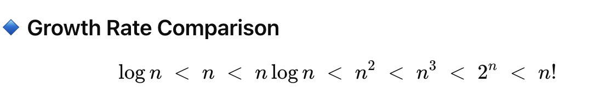

**What is Big-O?**

- **Big-O notation** describes how the runtime (or space) of an algorithm grows with the inut size *n*.
- We ignore constants and lower-order terms.
- Example: 3n^2 + 5n + 10 => O(n^2).

**Common Time Complexities**

| Complexity    | Name         | Example Algorithm              |
| ------------- | ------------ | ------------------------------ |
| $O(1)$        | Constant     | Access array element           |
| $O(\log n)$   | Logarithmic  | Binary Search                  |
| $O(n)$        | Linear       | Linear Search                  |
| $O(n \log n)$ | Linearithmic | Merge Sort, Quick Sort (avg)   |
| $O(n^2)$      | Quadratic    | Bubble Sort, Insertion Sort    |
| $O(n^3)$      | Cubic        | Matrix multiplication (naive)  |
| $O(2^n)$      | Exponential  | Recursive Fibonacci            |
| $O(n!)$       | Factorial    | Traveling Salesman brute force |

**Growth Rate Comparison**

- [Big-O examples](big_o_code.py)